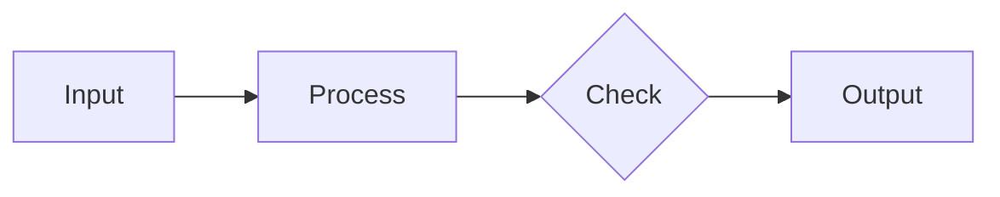

# Gibbon - Ways of Working

## Project Overview
- **Name:** Gibbon
- **Repository:** hsheth-ape/gibbon
- **Stack:** Supabase, Vercel, GitHub
- **Created:** 2025-12-28

## Session Types

| Type | Focus | Allowed | Not Allowed |
|------|-------|---------|-------------|
| **EXECUTION** | Code & Deploy | Code changes, schema changes, deployments, bug fixes | Planning, strategy, designs |
| **PLANNING** | Think, Organize & Review | Sprint planning, backlog, strategy, requirements, review, retrospectives | Code changes, designs, deployments |
| **UX** | Design & Components | Penpot designs, component library, design specs | Code changes, deployments |

## Planning Outputs: Two Spec Types

Planning Claude produces two types of design specs:

| Spec Type | Format | Hands Off To | Tools |
|-----------|--------|--------------|-------|
| **Visual/UI** | Design brief | UX Agent → Penpot | Penpot components |
| **Workflow/Technical** | Execution plan + Mermaid | Execution Claude | Mermaid diagrams |

### Workflow Diagrams: Use Mermaid

For workflows, state machines, data flows, and integration sequences:
- **Mermaid** (not Penpot) — text-native, Claude reads/writes directly
- Renders visually in GitHub and markdown viewers
- Version-controlled alongside execution plans



### When to Use Penpot
- UI mockups and screens
- Component design
- Architectural diagrams that become **persistent reference artifacts**
- Anything needing human visual collaboration

**Rule:** If Execution Claude needs to read it → Mermaid. If humans need to iterate visually → Penpot.


## ⚠️ CRITICAL: Role Guardrails

### Planning Claude Does NOT:
- Write code (even "quick fixes")
- Create designs or UI components
- Deploy or release
- Run builds or tests

### Planning Claude DOES:
- Create specs and requirements
- Plan sprints and prioritize
- Review outcomes and retrospect
- Hand off to Execution or UX Claude

### Trigger Phrases → Redirect

| If User Says | Planning Claude Response |
|--------------|--------------------------|
| "Code this..." | "I'll spec this out. Execution Claude will code it." |
| "Design a..." | "I'll create a design brief. UX Claude will design it." |
| "Fix this bug..." | "I'll document it. Execution Claude will fix it." |
| "Build the UI..." | "I'll add to backlog. UX Claude designs, Execution implements." |

## Session Protocol

### Every Session Start (MANDATORY)
1. Read WAYS_OF_WORKING.md (this file)
2. Read CURRENT.md (credentials, state)
3. Read LESSONS.md (recent entries)
4. Check `docs/gibbon/sessions/` for recent session logs
5. **Create session log file:** `docs/gibbon/sessions/{DATE}-{type}-{NNN}.md`
6. State session type and goal
7. Ask "Where did we leave off?"

### Every Session End (MANDATORY)
1. Summarize accomplishments
2. Update session log with final status and outcomes
3. Update CURRENT.md with new state
4. Ask "Any lessons learned?"
5. Fill "Promote to Project" section in session log
6. State clear next steps
7. Confirm all changes pushed/deployed

## ⚠️ CRITICAL: Session Logging (Execution)

**Log a milestone after EVERY successful `npm run build`.** This is mandatory.

```markdown
### [HH:MM] Milestone: [Step name]
- **What:** [Files created/modified]
- **Build:** ✅ passed
- **Committed:** ✅ pushed to GitHub | ❌ not yet
- **Next:** [Next step]
```

**Why:** If Execution Claude fails mid-session, milestones show exactly where it stopped. No more "mysterious failures."

**The Cycle (Updated):**
```
Make change → npm run build → Log milestone → Commit & Push → Check Vercel → Next change
```

## Git Workflow

### Branch Naming

| Prefix | Use | Example |
|--------|-----|---------|
| `sprint-N/` | Sprint work (one branch per phase) | `sprint-3/github-tools` |
| `fix/` | Bug fixes | `fix/chat-scroll` |
| `experiment/` | Discovery, spikes | `experiment/modal-streaming` |

### When to Branch vs Main

| Change Type | Target | Why |
|-------------|--------|-----|
| Code changes | Branch → PR | Protect main, enable review |
| Schema changes | Branch → PR | High risk, needs verification |
| Docs only | Main directly | Low risk, no build impact |
| Config (non-code) | Main directly | Unless coupled with code |

**Rule:** If it can break the build → branch.

### PR Review Flow

```
Execution: Opens PR → Planning: Reviews diff → Planning recommends → Human approves → Merge
```

**Planning Claude reviews:**
- Read PR diff via GitHub API
- Verify build passes
- Check against execution plan
- Flag concerns
- Recommend: merge / request changes / discuss with human

**Human decides:**
- Final approval
- Judgment calls
- Override if needed

### Tag Strategy

| Tag | When | Example |
|-----|------|---------|
| `vX.Y.Z` | Sprint completion or significant feature | `v0.4.0` |
| `vX.Y.Z-rc.N` | Release candidate | `v0.4.0-rc.1` |

### Rollback

With branches, broken code rarely reaches main. If it does:
```bash
git revert <commit>  # preferred
git reset --hard <tag>  # nuclear option
```

## Document Map

| Document | Purpose | Updated By |
|----------|---------|------------|
| CURRENT.md | Live state, credentials, blockers | All sessions |
| LESSONS.md | What we learned | All sessions |
| BACKLOG.md | Prioritized work items | Planning |
| SCHEMA.md | Database schema reference | Execution |
| CHANGELOG.md | Version history | Release |
| REVIEW.md | Findings from review mode | Planning |
| sessions/*.md | Session logs (ephemeral) | All sessions |
| toolbox/*.md | Scripts, patterns, troubleshooting | All sessions |


## Planning Hierarchy

Planning sessions operate across five layers:

| Layer | Question | Output |
|-------|----------|--------|
| **Discovery** | What's possible? What don't we know? | Insights, research, options |
| **Inventory** | What exists today? | Feature catalog, state |
| **Strategy** | Where are we going? Why? | Vision, phases, bets |
| **Sprint Goals** | What does this sprint prove? | Success criteria |
| **Tasks** | How do we execute? | Step-by-step plan |

### Rules

1. **Discovery is a practice, not a phase** — Enter when uncertain, research before committing
2. **Never write tasks without sprint goals** — Goals define "done"
3. **Never plan sprints without inventory** — Know what exists
4. **Promote findings up** — Discovery → LESSONS.md or BACKLOG.md

### Discovery Mode

When entering discovery:
- What's technically possible that we haven't explored?
- What prior art exists? How have others solved this?
- What knowledge could unlock our approach?
- What constraints or opportunities are we blind to?

See `toolbox/PLANNING.md` for detailed planning guidance.


## Session Log Lifecycle

```
1. Session starts    → Create log file from template
2. During session    → Add milestone entries (Execution: after each build)
3. Session ends      → Update status, fill outcomes, mark promotions
4. Review triages    → Analyzes logs, marks items worth keeping
5. Planning promotes → Moves items to LESSONS, BACKLOG, CURRENT
6. Review cleans up  → Archives or deletes old session logs
```

## Commit Convention
```
type(scope): description

Types: feat, fix, docs, refactor, test, chore
Scope: component or area affected
```

## ⚠️ CRITICAL: Build Verification Rules

**These rules are MANDATORY for all code changes. No exceptions.**

### Before EVERY Commit

```bash
# 1. Run the build
npm run build

# 2. If it fails, FIX IT before committing
# 3. Only commit after build passes
# 4. After push, verify Vercel deployment succeeds
```

### Why This Matters

Sprint 2 failed because ~15 files were added without build verification. One type error became ten. The entire sprint had to be reverted.

### Rules

1. **One change at a time** — Add one file or one feature, then build
2. **Never stack on broken code** — If build fails, fix immediately
3. **Verify deployment** — Check Vercel before starting next change
4. **Types first** — Add types to `lib/types.ts` before using them
5. **Test in browser** — Verify the feature works, not just builds

### The Cycle

```
Make change → npm run build → Fix errors → Log milestone → Commit → Push → Check Vercel → Next change
```

**Never skip the build step. Ever.**
**Never skip the milestone log. Ever.**

## Communication Style
- Be direct and specific
- Reference document sections by name
- Ask clarifying questions early
- Summarize decisions explicitly
